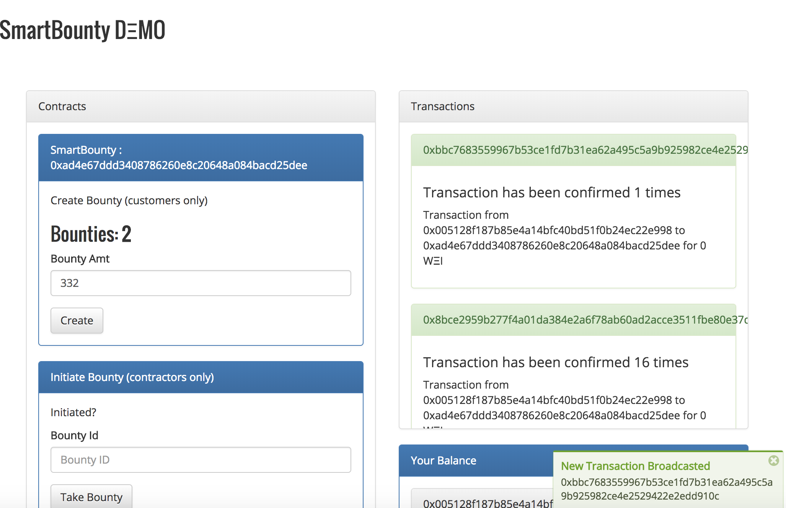

# SmartBounty
Bounty system for public services / infrastracture.

## Prereqs

`npm install -g ganache-cli`

`npm install -g truffle`

`npm install --save vort_x vort_x-components`

## Setting up

In root folder, make sure all packages are installed

`npm install`

Start ganache `ganache-cli -p 8545 -b 3`

Compile and migrate smart contracts

`truffle compile`

`truffle migrate --reset`

Start dev server

`npm start`

[Trello Project Management Board](https://trello.com/b/gxXmAL1w)